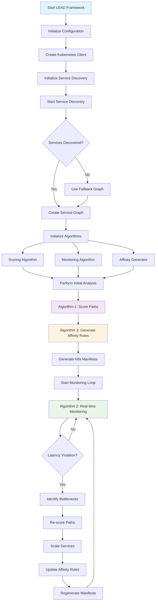
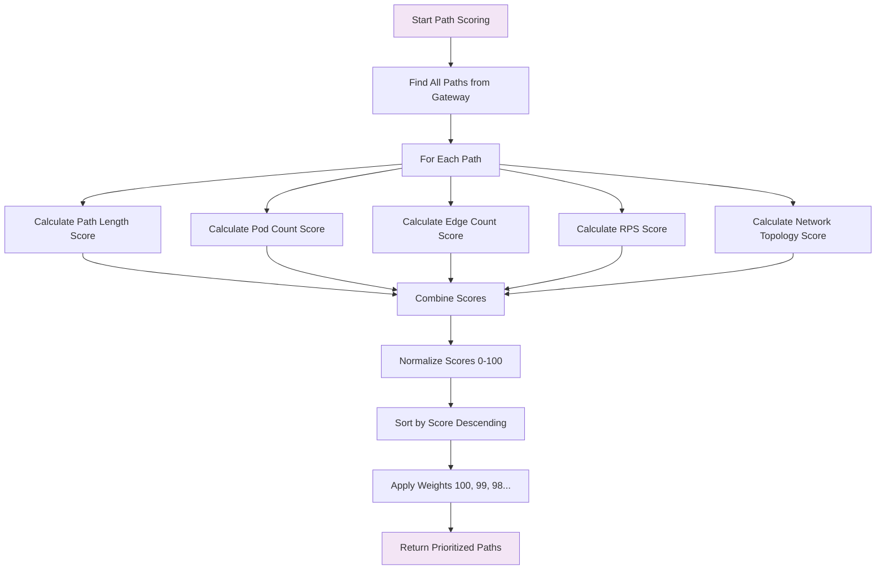
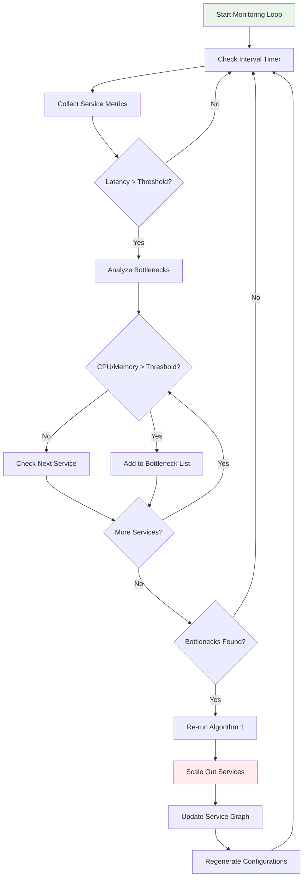
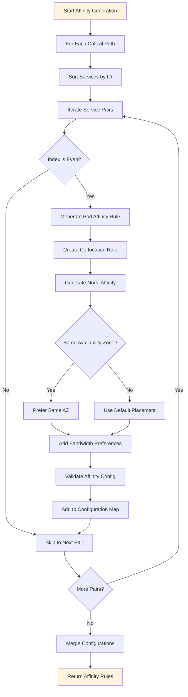
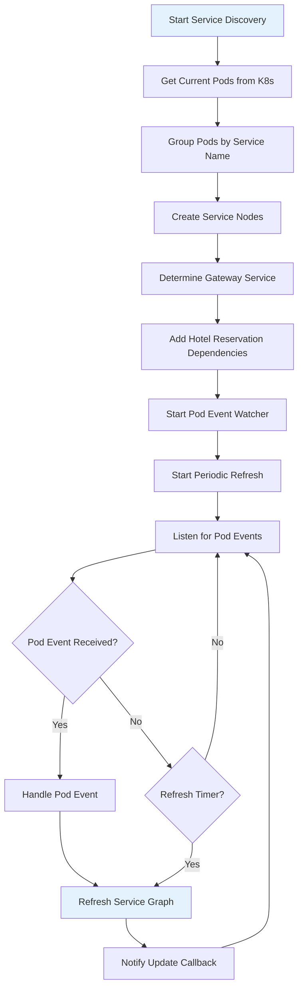
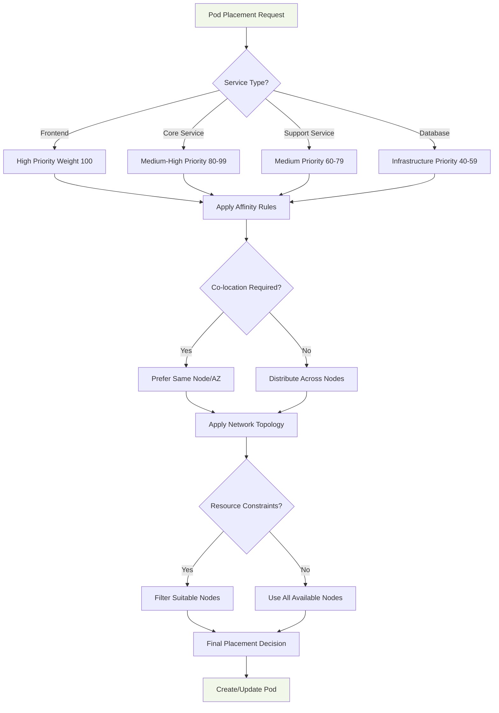
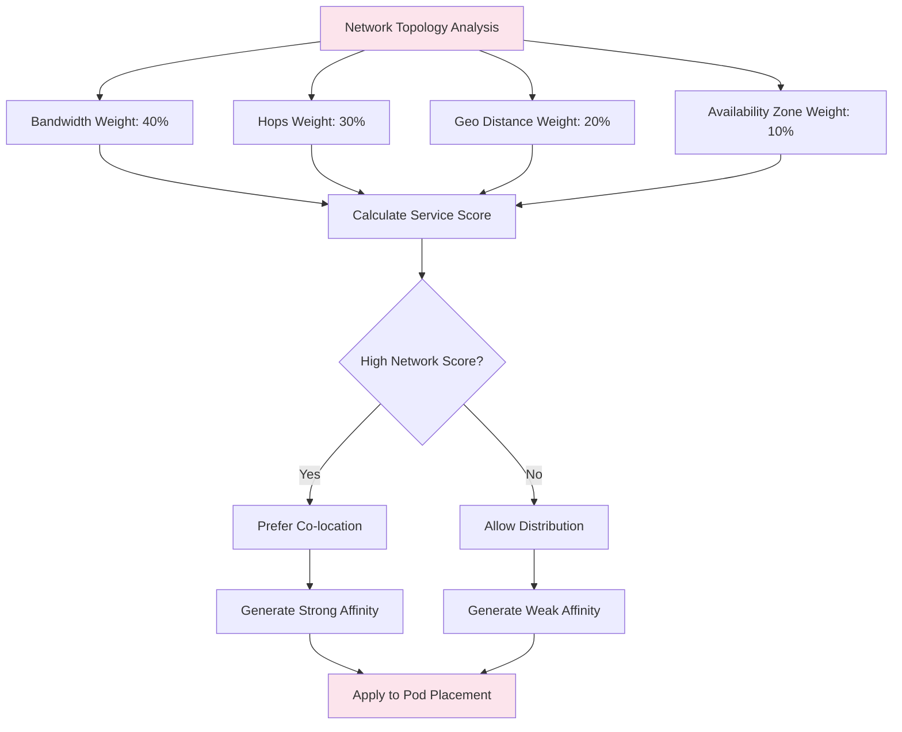

# LEAD Framework Pod Placement Flow Chart

## Overview
The LEAD (Latency-aware Edge Application Deployment) Framework implements intelligent pod placement for microservices using three core algorithms and dynamic service discovery.

## Main Flow Chart

## Detailed Algorithm Flows

### Algorithm 1: Path Scoring and Prioritization

### Algorithm 2: Real-time Monitoring and Auto-scaling

### Algorithm 3: Affinity Rule Generation

## Service Discovery Flow

## Pod Placement Decision Matrix

## Network Topology Considerations

## Key Components and Their Roles

### 1. **Service Discovery**
- Dynamically discovers running pods and services
- Creates service graph with dependencies
- Monitors pod lifecycle events
- Estimates network topology and performance metrics

### 2. **Scoring Algorithm (Algorithm 1)**
- Evaluates all possible paths from gateway to leaf services
- Considers path length, pod count, edge count, RPS, and network topology
- Assigns priority weights (100, 99, 98...) to critical paths
- Normalizes scores to 0-100 range

### 3. **Monitoring Algorithm (Algorithm 2)**
- Continuously monitors service metrics (CPU, memory, latency)
- Detects latency violations and resource bottlenecks
- Triggers automatic scaling when thresholds are exceeded
- Re-runs path scoring after scaling events

### 4. **Affinity Rule Generator (Algorithm 3)**
- Generates Kubernetes affinity rules for co-location
- Processes service pairs from critical paths
- Creates pod affinity and node affinity rules
- Considers network topology for optimal placement

### 5. **Kubernetes Integration**
- Generates deployment and service manifests
- Applies affinity rules to pod specifications
- Monitors cluster state and pod events
- Manages scaling operations

## Configuration Parameters

| Parameter | Default | Description |
|-----------|---------|-------------|
| MonitoringInterval | 15s | How often to check service metrics |
| ResourceThreshold | 75% | CPU/Memory threshold for scaling |
| LatencyThreshold | 150ms | Network latency threshold |
| BandwidthWeight | 0.4 | Weight for bandwidth in scoring |
| HopsWeight | 0.3 | Weight for network hops |
| GeoDistanceWeight | 0.2 | Weight for geographic distance |
| AvailabilityZoneWeight | 0.1 | Weight for AZ preference |

## Hotel Reservation Service Dependencies

The framework is specifically designed for the Hotel Reservation benchmark with these service dependencies:

- **Frontend** → Search, User, Recommendation, Reservation
- **Search** → Profile, Geographic, Rate
- **User** → Rate

This dependency graph influences pod placement decisions to minimize inter-service communication latency.
